#Red Hat Partner Demo System 2018
##Demo on Red Hat Management Suite

Author: **Amaya Rosa Gil Pippino**

##README.1ST

The goal of this demo is to introduce you to a variety of Red Hat products that can help you with managing and automating infrastructure resources. You will be able to demonstrate the power and flexibility of Red Hat management using either one or a combination of Red Hat products, such as Red Hat Satellite, Ansible Tower by Red Hat, Red Hat Insights, it is up to you to show all of them or a subset, depending your needs.

This demo is geared towards systems administrators, cloud administrators and operators, architects, and others working on infrastructure operations interested in learning how to automate management across a heterogeneous infrastructure. 

The audience is for SAs willing to show Red Hat Management products with no previous knowledge on them, of course, the prerequisite for this demo include basic Linux skills gained from Red Hat Certified System Administrator (RHCSA) or equivalent system administration skills. Knowledge of virtualization and basic Linux scripting would also be helpful, but not required. 

# Step 0: Setup & Getting Started

### Logging into all the Red Hat Products

Let’s log into the Red Hat Products that you will use in this lab so they are ready to use.

In this lab application based self-signed SSL certs are going be used, please note that they are being used and should accepted in order to complete the lab exercises.

Let’s log into the Red Hat Products that you will use in this lab so they are ready to use.

1. From the lab environment information page, copy the hostname of the Workstation system (it should be workstation-GUID.rhpds.opentlc.com where GUID matches your environment’s guid).

2. Open a terminal window on your desktop environment and make sure you can SSH into the workstation host as you see below:

3. [lab-user@localhost ~]$ ssh lab-user@workstation-GUID.rhpds.opentlc.com

4. **Run ‘sudo -i’ once you logon as lab-user to the jumpbox. This gives you root, and root has SSH keys for every host you will need to login to**.

###NOTE:
**This step is not required**, but If you need to troubleshoot or power on/off/reboot a system, you can use the environment’s power control and consoles by clicking the link on your GUID page. The password for any consoles will be with username ‘root’ and password "**r3dh4t1!**". From this page, you will be able to access all of the Red Hat Products that you will use in this lab. Press the start button at the top right to turn on all the Red Hat Product VMs. Then, click on https for all the Red Hat Products to access the UI. For applications, You may also log into the UI of all the Red Hat Products with ‘admin’ as the Username and “**r3dh4t1!**” (without the quotes) as the Password.

The following labs take place within the fictional **EXAMPLE.COM** company.

# Demo 1: Red Hat Satellite for Red Hat Insights Management

### Goal of Section

In this section, you will be provided the necessary steps and background information on how to use Red Hat Satellite for Red Hat Insights management, as a proxy instead of using the customer portal. You will be walked thru a series of steps that cover the main Red Hat Insights topics from the Satellite Web interface, so please, **do not remove the pre-populated values**.

This is an example of use case.  Who you're presenting to will obviously vary based on team structure, size of company, industry, unique issues, etc... these are the issues to think about as you prepare for your demo.

### User Persona Overview

Today we are wearing Allison’s shoes.

Ally is a system administrator for Example company. She is tasked with managing different infrastructures than run the different company services.

Ally is in distress because she’s the only Linux system administrator at Example (here you can fit the story to what fits best for your customer, it may be an small company or she’s alone because everyone else is gone on vacation) and she needs to do all the daily administrative tasks (rolling out new services, creating new user accounts, provide them with quotas, etc) while she needs to make sure all the current services are up and running, and hence the underlying Linux infrastructure is running healthy as well.

Ally has a lot in her plate, but she’s not alone. She’s discover a very powerful tool to help her in her daily job. She has now discovered that along her Satellite subscription she is entitled to use Red Hat Insights at no additional cost.

Red Hat Insights was designed to proactively evaluate the security, performance, and stability of the Red Hat platforms by providing prescriptive analytics of the systems. Insights helps move you from reactive to proactive systems management, delivers actionable intelligence, and increases visibility of infrastructure risks and the latest security threats. Operational analytics from Insights empowers you to prevent downtime and avoid firefighting, while also responding faster to new risks. This is why Ally's investigating Insights to help her.

While this is being demo'd as if it's already installed and configured, it's actually quite simple to install, in this case, Ally’s installed Red Hat Insights client in all of her systems (with an Ansible playbook already provided by Red Hat) with no previous Ansible knowledge.

Then, Ally logs either on the external Red Hat Customer Portal or into her internal Satellite Web Interface to interact with Insights and there she can see the actual health of he infrastructure.

She is also able to create remediation plans with the simple use of a mouse click and define what systems she wants to fix and the different issues he wants to address, based on her company policies. Sometimes Ally applies the fixes as soon as she sees them on Insights and some other times, she waits to have a maintenance window. These plans are created on the fly by Insights in the form of an Ansible Playbook, and Ally simply has to apply them.

In this demo we will look at one day in the life of Ally, the system administrator.

### Notes about Satellite Environment and Configurations

Based on the structure/mobility of the demo, it’s possible to run into some issues with certain services therein. If you run into anything, you can run the following to fully restart the satellite services:

SSH from your jumpbox as outlined in Step 0 to root@sat.example.com:

[lab-user@workstation $] sudo -i
[root@workstation #] ssh sat.example.com
[root@satellite ~]# katello-service restart

### Log into the environment

***Access to the Satellite server from your browser: Although several browsers are supported, we recommend the use of Firefox***. Remember, as previously mentioned, if you see an SSL warning, accept this for the lab  as its a self-signed certificate from the application.

Point your web browser to https://sat-GUID.rhpds.opentlc.com or click on your lab GUID page that is open in your browser and open the link for your Satellite.

Where GUID is your unique identifier as described in Lab 0.

When logging into these systems you could potentially receive the following due to a self signed certificate: 

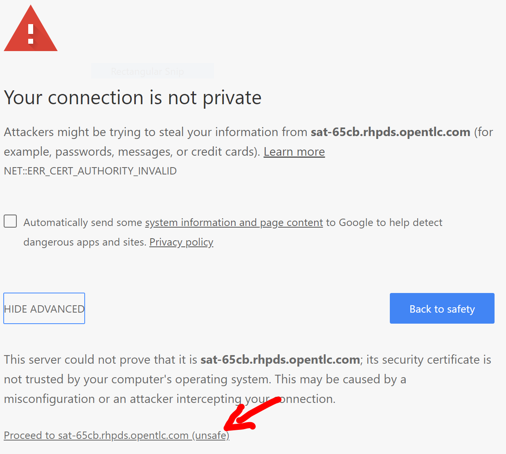

And for Firefox…

Click "Advanced" to open the advanced menu, and then “Proceed to ….” or “Add Exception” and “Confirm Security Exception”  at the bottom of the dialogue. 

The warning is due to a self signed certificate authority potentially not being available on your local workstation and if you’re using the Chrome browser.

Now that we’ve navigated to the login, login as user "**admin**" with the password “**r3dh4t1!**” as mentioned previously in this guide.

Once you’ve logged into Red Hat Satellite, you will see the main dashboard:

### 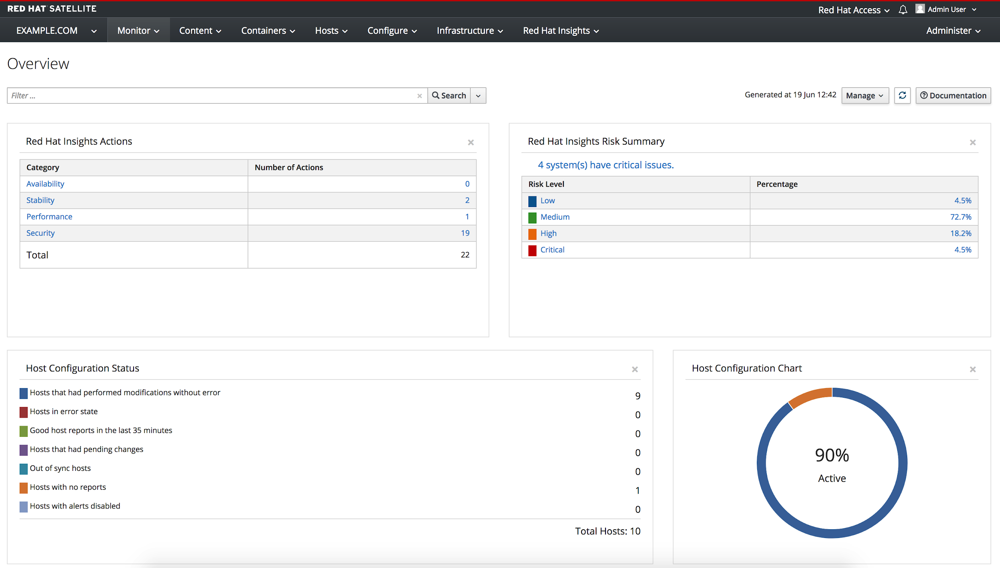

Ally from her office spot has logged into the Satellite Web UI and has gone to Insights tab. Since Ally has her machines registered to Satellite, Insights is already reporting information into Satellite, as you can see in the right upper corner. From the main dashboard and just with a glance, Ally is able to see the overall health of the systems, showing here the most critical issues that need attention. This is what she does every day, and she’s able to maintain her systems healthy with no more resources.

**Background**:

The following are the steps needed to get your Red Hat Insights managed hosts registered to Red Hat Satellite, you’d not need to perform any of these, but they are here just in case you need explain them to your audience.  

You’d need to login to your client VM, first SSH into your workstation node at workstation-*<GUID>*.rhpds.opentlc.com as lab-user, the sudo to root. Should a password be required, use "**r3dh4t1!**" as  your password. 

**[lab-user@localhost ~]$ ssh lab-user@workstation-GUID.rhpds.opentlc.com**
**[lab-user@workstation-GUID ~]$ sudo -i**
**[root@workstation ~]#**

From there, this is your "jumpbox" that will allow you to access each of the client machines (ic1.example.com through ic9.example.com), also using ssh (ssh passwordless has already been configured for your convenience). The following are the commands used.

**[root@icX ~]# curl https://sat.example.com/pub/bootstrap.py > bootstrap.py --insecure**
**[root@icX ~]# chmod +x bootstrap.py**

Run the bootstrap.py script using the Satellite manifest that uses certificate based authorization in order to register your machines with Satellite as follows (provide the password when required):

**[root@icX ~]#**** ./bootstrap.py -l admin -s sat.example.com -o 'EXAMPLE.COM' -L 'Default Location' -g rhel7 -a rhel7**

In addition, manual installation and registration of the Insights client is possible by performing the following:

NOTE: On RHEL 7.5 client RPM has been renamed to insights-client, but this demo machines are using RHEL 7.0 and 7.3 for demonstration purposes, so the package name is still the old one.

To install Insights RPM in each of your systems issue the following command:

**[root@icX ~]# ****yum -y install insights****-client**

And then, simply register each machine with Red Hat Insights as follows:

**[root@icX ~]# insights-client --register**

**NOTE: **Due to the configuration of the account used for this demo (it’s shared amongst the different instances) do you need to do this next step (my recommendation is that you perform it while explaining the persona overview, it takes around 5 mins to complete). It’s a playbook that basically does all what’s explained above.

**REQUIRED STEP!!!!**

From the jumpbox machine, jump to the tower one and execute the following playbook:

**[root@workstation ~]# ssh tower**

**Last login: Thu Jul 19 09:15:27 2018 from workstation.example.com**

**[root@tower ~]# cd playbooks/**

**[root@tower playbooks]# ****ansible-playbook canned-demo.yml**

What this does, it’s assuring machines are registered to Insights and Satellite and then, making sure there’s something to be fixed. **This step is required.**

# Demo 2: Red Hat Insights To Solve Security Issues

Since Red Hat Insights recommendations are tailored for the individual system where risk is detected, Ally is able to be certain that actions identified by Insights are validated and have a verified resolution for each detected risk, reducing false positives you may experience from critical risks identified by third-party security scanners. Insights provides predictive analysis of security risk in the infrastructure based on a constantly evolving threat feed from Red Hat.

Through analysis of Insights metadata and curated knowledge based on over fifteen years of enterprise customer support, Red Hat is able to identify critical security vulnerabilities, statistically frequented risks, and known bad configurations. We scale this knowledge to our customers with Insights reporting and alerts, allowing prediction of what will happen on a monitored system, why it will happen, and how to fix a problem before it can occur.

Recommendations from Insights are human-readable and in most cases can simply be copy and pasted into the terminal to resolve the issue. You may also automate remediation of hosts in your infrastructure with Insights generated Ansible playbooks or Ansible Tower integration.

## Fixing the payload injection security issue in your system using Red Hat Insights from the Satellite UI

### Automatically fixing the payload injection security issue via Ansible Playbook

In this demo, we want to show how Red Hat Insights detects and fixes issues in an IT infrastructure. Insights provides you with a detailed list of steps or with an Ansible playbook that is generated on the fly (it even allows you to choose from a different set of options when available) for you to either run it manually or via Ansible Tower. This demo covers it all.

First, we will see how Ally identifies the different issues affecting the IT infrastructure;  to do so, from the Satellite UI, click on **Red Hat Insights** **→ Overview, **where you should see all the registered systems (9), actions summary (highlighted by priority) as well as latest updates from Red Hat.

** **

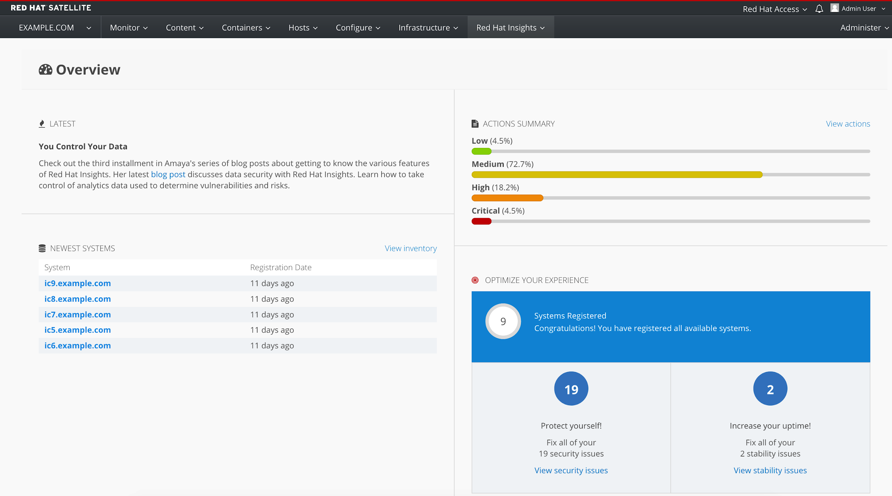

In this demo, we will fix the specific "**Kernel vulnerable to man-in-the-middle via payload injection (CVE-2016-5696)****"** on your client VMs without causing downtime, which is also a security threat.

As mentioned, Insights generates an Ansible Playbook that Insights provides us. You can see that in the top left corner of every single issue with the Ansible logo in blue if a playbook is available, or in grey if it’s not.

Click on any of your client VMs, **icX.example.com**. You will see the list of issues affecting it when clicking on the system name.

1. Notice that your system(s) shows up with multiple security vulnerabilities. 

*Note: Our objective is to fix the payload injection problem without causing downtime, and see that it no longer appears as a vulnerability in Insights. Specifically, this payload injection problem causes the kernel to be vulnerable to man-in-the-middle via payload injection. A flaw was found in the implementation of the Linux kernel's handling of networking challenge ack (**[RFC 596*1](https://tools.ietf.org/html/rfc5961)*) where an attacker is able to determine the shared counter. This flaw allows an attacker located on different subnet to inject or take over a TCP connection between a server and client without needing to use a traditional man-in-the-middle (MITM) attack.*

2. Use your browser’s search function to search for "**payload injection**". 

*Note: Reading the description for the vulnerability shows that the ***_sysctl _***variable is set to a level that allows being exploited. We want to do the active mitigation by changing the ***_sysctl _***variable and making it permanent on reboot. In this case, we do not want to update the kernel or reboot since we don’t want downtime. *

*We will firstly do it by executing an ansible playbook from the command line, then we will do it from ansible Tower, so all the options are able to be shown to your audience.*

In the particular case of the payload injection security issue, an Ansible Playbook is available for us.

Now we’d need to create a plan in which the issues that are found will be solved using an Ansible Playbook. In this demo, it is already created and stored in the tower machines, but just for demonstration purposes, we’ll do it again.  To do so, from your Satellite 6.3 UI, click on **Red Hat Insights** **→ Planner.**

And once there, click on **Create**** a plan**.

Fill in the boxes as in the example, and do not forget to select only the payload injection security issue and select any or all the **icX.example.com** systems in which this solution is to be applied (then this playbook won’t be used). Then click "save".

** ** 

Insights offers us two ways to solve this issue, one is by updating the kernel, and the other one is apply the needed changes to the **/etc/sysctl.conf** file to add the mitigation configuration, and reload the kernel configuration. 

Insights gives us the opportunity to choose the resolution that we want with the simple use of a mouse click. Please make sure to select "**Set sysctl ip4 challenge ack limit**" as your preferred choice and then click on the Save button.

 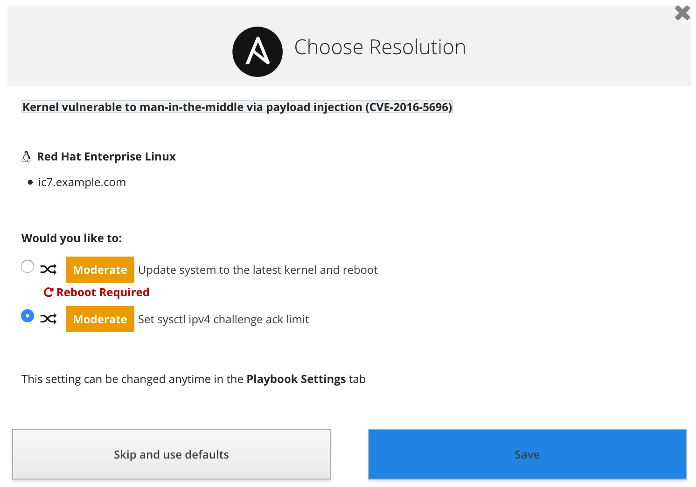

Once the plan is saved, the planner screen is shown where you can see the newly created plan, as well as the issues it resolves and the systems affected.

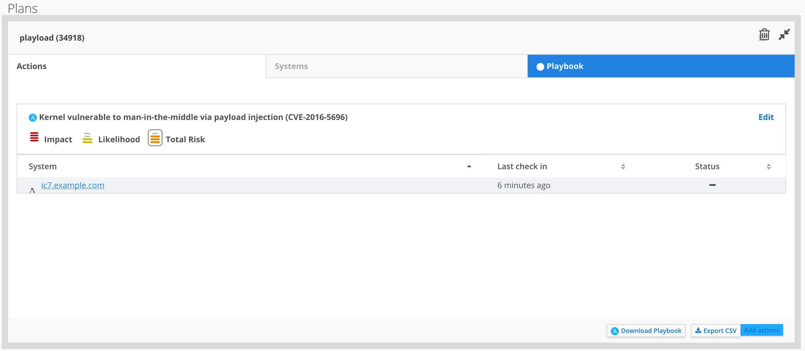

If not already there, login to your client VM, first SSH into your workstation node at workstation-*<GUID>*.rhpds.opentlc.com as the lab-user. An ssh key is already in the home directory of your laptop, which should allow you to login without a password. Should a password be required, use "**r3dh4t1!**"  as  your password. 

**[lab-user@localhost ~]$ ssh workstation-GUID.rhpds.opentlc.com**

**[lab-user@workstation-GUID ~]$ sudo -i
[root@workstation ~]#**

Now that you are in the workstation node, SSH into the tower machine in order perform the recommended active mitigation with the Ansible Playbook. 

As mentioned before, no previous Ansible knowledge is needed, this is what allows Ally to solve issues on her infrastructure rapidly and effectively, whenever her company policies allows her to do so. She simply needs to execute the automatically generated playbook from the command line.

NOTE FOR PRESENTERS:

The playbook that’s generated in this demo is already downloaded into the Tower machine for your convenience.

**[root@workstation ~]# ssh tower**

Inspect the Ansible Playbook that Insights has created automatically for you:

**[root@tower ~]# less payload-injection.yml**

And also, SSH into your RHEL7 client/host. 

**# ssh ic6**

You could, as **root**, perform the recommended active mitigation (in one of the machines) or just show your audience the file before and after the execution of the playbook, **/etc/sysctl.conf.**

**	**

To do it manually, simply run:

**# echo "net.ipv4.tcp_challenge_ack_limit = 2147483647" >> /etc/sysctl.conf**

**# sysctl -p**

**net.ipv4.tcp_challenge_ack_limit = 100**

**vm.legacy_va_layout = 0**

**net.ipv4.tcp_challenge_ack_limit = 2147483647**

From the Ansible Tower machine’s command line, just execute the playbook "payload-injection.yml" to solve all the payload injection vulnerabilities in all your 9 client machines.

**[root@tower ~]# cd playbooks/**

**[root@tower playbooks]# ansible-playbook payload-injection.yml**

After applying the active mitigation, we want to have the system report any changes, so, the playbook finalizes by running insights client.

Wait until this step completes before moving to the next step.

From your Satellite 6.3 UI, click on **Red Hat Insights** **→ Inventory. **

**	**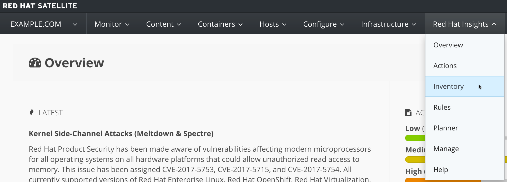

Click on any of your client VMs, **icX.example.com**. You will notice than the number of actions has decreased by one.

	

Use your browser’s search function to search for "**payload injection**". You will notice that this payload injection issue is no longer listed due to fixing the vulnerability.

Congratulations, you’re no longer vulnerable to the payload injection vulnerability!

Please note that when the execution is completed, the Insights agent is also run, so the latest state of the system is reporting into Insights automatically.

### Optional! Automatically fix all the issues on your IT infrastructure that have playbooks from the command line

If your audience is willing to spend some more time, you can go and fix all the issues in your infrastructure either from the command line (as previously) or using Ansible Tower. This section shows only the command line. 

**IMPORTANT**: Please note that solving all your issues does not allow to revert to the original state, so only run this here if your audience is not interested in seeing Ansible Tower integration for automatic remediation.

Again, you will show your audience how to create a plan that solves all the issues in your infrastructure, however, the playbook is already created and downloaded to the tower machine.

 

From the Satellite UI, click on **Red Hat Insights** **→ Inventory **so we can focus on the whole infrastructure.

In the inventory screen, select both systems and click on Actions, on the top left corner, and then select Create a new Plan / Playbook.

This way, we are going to create an Ansible Playbook-based plan to solve issues on those two specific systems (systems can also be grouped as per our convenience, from that very same menu).

The Plan / Playbook Builder screens appears. Please make sure to fill the boxes as follows:

Plan name: fix-all

Actions: all (do this by clicking on the box by the Action label at the top).

Your screen should look like:

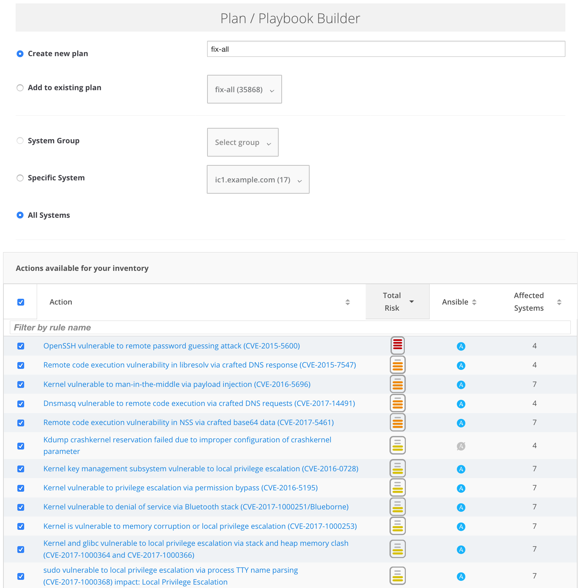

Then click on the Save button in the bottom right corner.

As before, you are given the option to choose between different ways to solve your issues. In this demo, we’ve chosen to go for the ones that do not require a reboot, in order to save some time, but for your demonstration purposes, you can choose whatever option you may consider.

The plan description screen appears.

You should see all the issues this plan is going to solve as well as the affected systems.

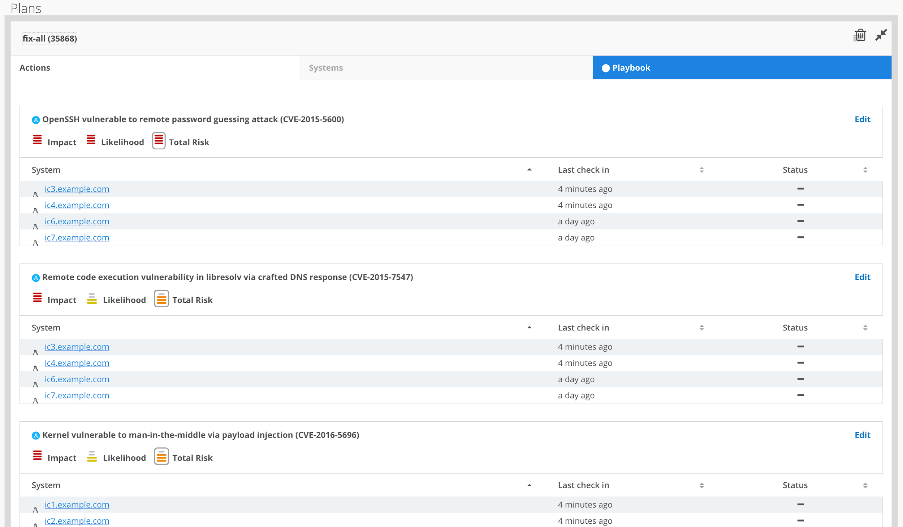

Scrolling down the screen, you should be able to download the playbook.

Like in the previous step, we need to log into the tower machine in order to run the Ansible Playbook.

If not already there, login to your client VM, first SSH into your workstation node at workstation-*<GUID>*.rhpds.opentlc.com as the lab-user. An ssh key is already in the home directory of your laptop, which should allow you to login without a password. Should a password be required, use "**r3dh4t1!**"  as  your password. 

**[lab-user@localhost ~]$ ssh workstation-GUID.rhpds.opentlc.com**

**[lab-user@workstation-GUID ~]$ sudo -i
[root@workstation ~]#**

Now that you are in the workstation node, SSH into the tower machine in order perform the recommended active mitigation with the Ansible Playbook. 

**[root@workstation ~]# ssh tower**

Inspect the Ansible Playbook that Insights has created automatically for you:

**[root@tower ~]# vi fix-all.yml**

**[...]**

**_Output truncated_**

Now, simply proceed to remediate the issues by executing the Ansible Playbook as follows: 

**[root@tower playbooks]# ansible-playbook fix-all.yml**

**[...]**

**_Output truncated_**

Please note that when the execution is completed (this may take a while), the Insights agent is also run, so the latest state of the system is reporting into Insights automatically (this will also require some time).

Note that some of the issues won’t be able to be solved by the ansible playbook and you’d need to do some extra steps.

Now from the Satellite UI, click on **Red Hat Insights** **→ Inventory **you will notice that your systems have few issues.

Please, after solving these issues, revert the state by executing:

**[root@tower playbooks]# ansible-playbook rebreak-hosts.yml**

**[...]**

**_Output truncated_**

# Demo 3: Automatic Remediation with Red Hat Insights and Ansible Tower

## Goal of Section

The goal of this section is to allow you demonstrate the proactive security capabilities of Red Hat Insights and automatic remediation with Ansible Tower. You should require no prior Tower knowledge to follow all instructions.

## Reporting Insights Data into Ansible Tower

### Fixing issues automatically with Ansible Tower

Ally has learned Ansible Tower and now she’s able to solve automatically issues in her infrastructure automatically by having Insights reporting into Ansible Tower too, which allows her to solve even more time than before.

Tower supports integration with Red Hat Insights. Once a host is registered with Insights, it will be continually scanned for vulnerabilities and known configuration conflicts. Each of the found problems may have an associated fix in the form of an Ansible playbook. Insights users create a maintenance plan to group the fixes and, ultimately, create a playbook to mitigate the problems. Tower tracks the maintenance plan playbooks via an Insights project in Tower. Authentication to Insights via Basic Auth, from Tower, is backed by a special Insights Credential, which must first be established in Tower. To ultimately run an Insights Maintenance Plan in Tower, you need an Insights project, an inventory, and a Scan Job template.

So all that Ally needs to configure in Tower are credentials (to log into the company’s account and into the machines), an inventory of the machines, a project and a job template.

NOTE: In this demo you will be walked thru the needed steps to configure it all, even it’s already done. You can decide if you want to show it or just go to the job execution and reporting to show how it all looks like and how fixes are done by Tower.

### Credentials

First thing Tower needs to have configured, is credentials, in this case, Insights credentials, so you can log into Ally’s Insights account from Tower and see the state of the machines, as well as to remediate them.

Feel free to inspect the credentials already created (click on **Settings -> Credentials**) you should look at "**RH Customer Portal Insights Credentials**"

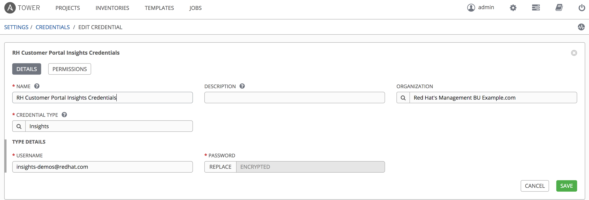

Please note, the Red Hat Customer Portal account name is given.

Now inspect the "**Example.com SSH Password**" credential. This is a machine credential, it is used for Tower to be able to log into the machines and execute commands, therefore, it’ll be used to remediate them.

### Inventories

The Insights playbook contains a **hosts:** line where the value is the hostname that Insights itself knows about, which may be different than the hostname that Tower knows about. Therefore, we need to make sure that the hostnames in the Tower inventory match up with the system in the Red Hat Insights Portal.

For your convenience, the Insights inventory has been already created for you, feel free to inspect it, as well (this one is an Smart Inventory which pulls information from Satellite).

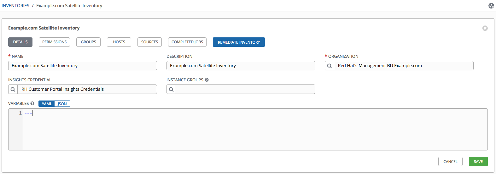

Please note that typically, your inventory already contains Insights hosts. Tower just doesn’t know about them yet. The Insights credential allows Tower to get information from Insights about an Insights host. Tower identifying a host as an Insights host can occur without an Insights credential with the help of scan facts.yml file.

In order for Tower to utilize Insights Maintenance Plans, it must have visibility to them. For that, we need to run a scan job against the inventory using a stock manual scan playbook (this is provided by Red Hat to its customers and is also already configured in this demo).

### Scan Project 

Go to the **Projects** main link to access the Projects page and click on "**Insights Scan Project**". Please notice the filled in fields, specially the **SCM URL** field, **https://github.com/ansible/awx-facts-playbooks**. This is  the location where the scan job template is stored (provided by Red Hat to all customers).

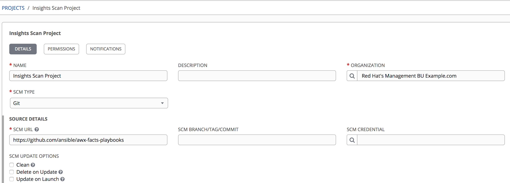

All SCM/Project syncs occur automatically the first time you save a new project. However, we want them to be updated to what is currently in Insights, so please, manually update the SCM-based project by clicking the  button under the project’s available Actions.

Syncing imports into Tower any Maintenance Plans in your Insights account that has a playbook solution. It will use the default Plan resolution. Notice that the status dot beside the name of the project updates once the sync has run.

Now it’s the time to put all the pieces together, by using a job template that uses the fact scan playbook.

### Templates

Click the **Templates** main link to access the Templates page and click on "**Insights Scan Template**". Please notice the filled in fields, specifically the “**Playbook**” field, this is the playbook associated with the Scan project we previously set up as well as “**Credential**” in this case, credential does not have to be an Insights credential, but machine. Also, notice the fields are populated with the previously commented items.

Your screen should look as follows: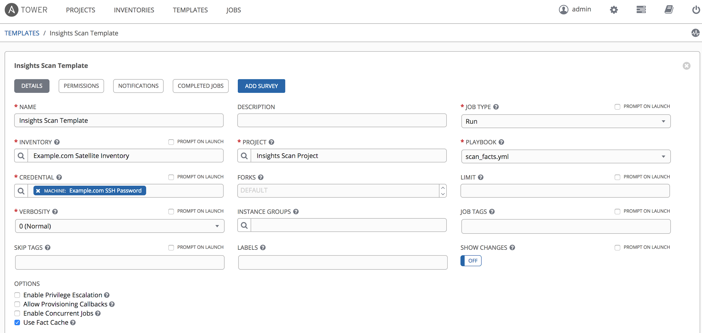

Click the  icon to launch the scan job template, the output you should see is something like this, if it all went as expected:

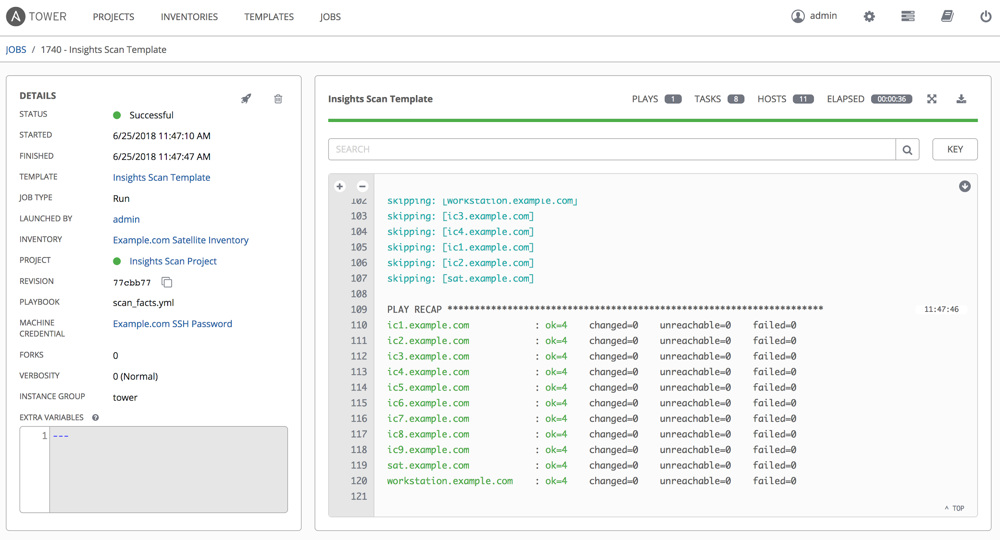

With this, we know the state our machines are in and issues they may have that should be remediated. 

Now, Ally is able to chose where she wants to see Insights data from, Ansible Tower UI, Satellite UI or Red Hat Customer Portal 

### Viewing Insights data into Tower

In order to do reporting from Insights, we need to use inventories. For this demo, as there is a Satellite server, we’ll use an smart inventory that pulls data from Satellite (creating it is out of the scope of this demo).

To see data from Insights, just click the **Inventories** main link to access the Inventories page and then choose "**Example.com Satellite Inventory**". 

This is the way to have it all connected in your infrastructure. 

This helps Ally to ease and fasten her repetitive administrative tasks. Her Satellite provision the machines and is the source of information for Tower to know what the machines are. Both of them are connected to Insights, so your machines’ health can be viewed and remediate from these tools just with a single mouse click. This is how Ally saves time for more complex tasks and can handle a data center on her own.

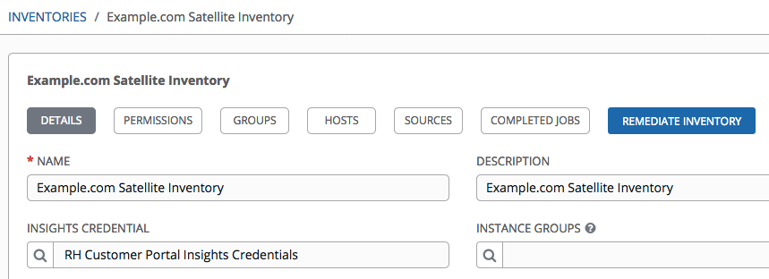

Click the **Hosts** tab to access the Insights hosts that have been loaded from the scan process. Once there, click to open one of the hosts that was loaded from Insights (ic6.example.com, for instance).

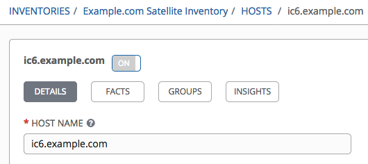

Notice the Insights tab is now shown on Hosts page. This indicates that Insights and Tower have reconciled the inventories and is now set up for one-click Insights playbook runs. Click on it.

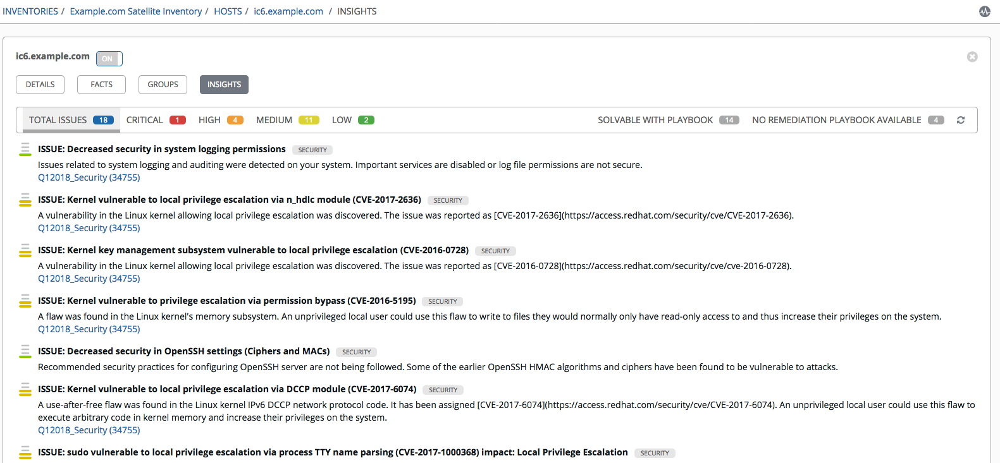

You now can see a list of issues Insights has identified and whether or not the issues can be resolved with a playbook is also shown.

## Automatically remediate Insights Inventory 

### Remediation Project

Remediation of an Insights inventory allows Tower to run Insights playbooks with a single click, instead of using the CLI as we did in the previous section of the demo. This project is also created, you just need to explore it.

Click the **Projects** main link to access the Projects page and then click on "Insights Remediation". Please notice the filled in fields, specially the **Project Base Path** which is populate with /var/lib/awx/projects (the directory where playbooks are stored locally in Tower).

Your screen should look as follows:

NOTE: In the real world, we would be accessing directly to our Red Hat account, however for the limitations of the configuration in this demo, this is not possible. In the real world, we’d need to choose Red Hat Insights as the SCM type and our Customer Portal Credentials (later in this lab we’d need to use them, and they have already been created for your convenience).

In the real world, you should be seeing something like the following screen:

### Remediation Job Template

Similar to the one before, we are to use a remediation job template that can use the remediation project we have just covered.

Click the **Templates** main link to access the Projects page and then, click on the "**Insights Remediation Template**". Please notice the filled in fields, specially the “**Playbook**” where ic1-ic4-fix-all.yml is already selected from the drop-down menu list. This is the playbook associated with the Remediation project we previously saw, which will fix both the payload injection vulnerability and the openssh vulnerability to remote password guessing attack.

As explained before, notice we are using again the machine credentials, as we need to log into the machines and execute commands there.

Your screen should look as follows:

Now, simply execute it by clicking on the rocket next to the name of the template in the templates list down the screen.

The playbook execution screen appears and shows you the result.

**Note: There is a known race condition where when executing the playbook it will fail on the first run for some older RHEL 7.0 hosts. Simply re-run the playbook and everything should complete successfully, and the hosts that failed the first ****time ****will complete remediation.**

Now you can demonstrate different scenarios depending on the time you have. If you explore the available playbooks by clicking on the dropdown menu you will see the following:

* ic1-ic4-fix-all.yml: This playbook fixes all the issues with an ansible playbook given solution in your ic1 to ic4 systems.

* ic1-ic4-payload-ssh.yml: This playbook fixes both the payload injection and ssh remote password guessing in your ic1 to ic4 systems

* ic8-ic9-all.yml: This playbook fixes all the issues with an ansible playbook given solution in your ic8 and ic9 systems.

* payload-injection.yml: This playbook fixes the payload injection in all your 9 systems

* payload-ssh-all.yml: This playbook fixes both the payload injection and ssh remote password guessing in all your 9 systems.

* fix-all.yml: This playbook fixes all the issues with an ansible playbook given solution in all your 9 systems. This takes some time ().

* rebreak-hosts.yml:  This playbook tries to break the machines again, please not it’s not possible to go back to the original state once fix-all.yml playbook is executed.

You can play around selecting one or the other playbook and then going back to satellite UI or from Tower as previously seen, to see the different state your machines go thru. If you want, after applying a solution, you can run the rebreak-hosts.yml playbook to revert those fixes.

