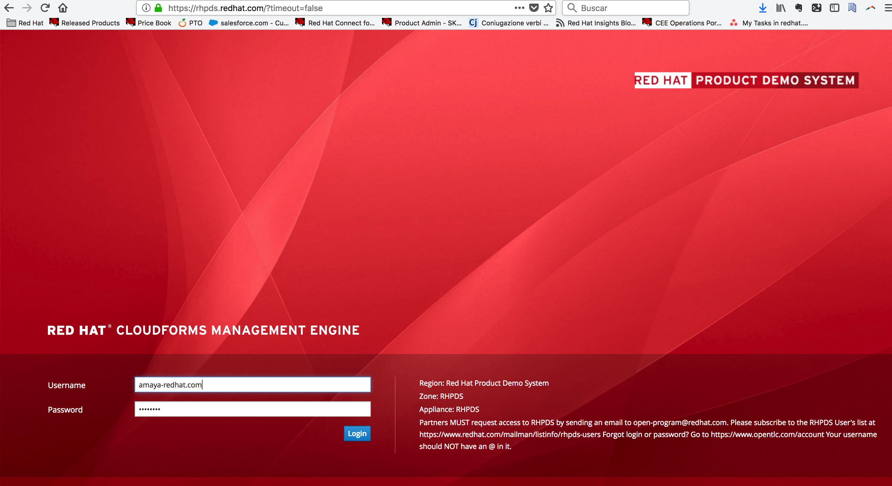
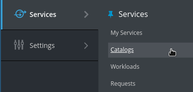
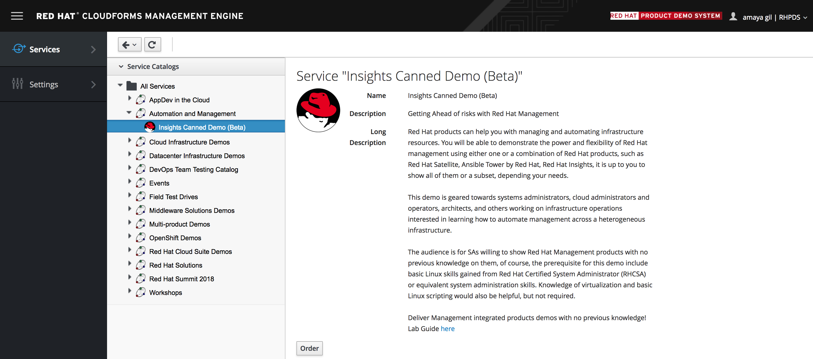

# Insights Canned Demo
Red Hat products can help you with managing and automating infrastructure resources. You will be able to demonstrate the power and flexibility of Red Hat management using either one or a combination of Red Hat products, such as Red Hat Satellite, Ansible Tower by Red Hat, Red Hat Insights, it is up to you to show all of them or a subset, depending your needs. Learn how to deliver demos without taking a Lab!

## Access the lab environment

First time login, forgot login or password? Go to https://www.opentlc.com/account.

* Your username should **NOT** have an **@** in it.

* Partners **MUST** request access to RHPDS by sending an email to ***open-program@redhat.com***.
 
* Passwords to the services is referred as \<to\_be\_provided\>. Please contact GPTE you didn't get them.

* Do not forget to upload your username's public SSH key to https://account.opentlc.com/update/, read the instructions at http://www.opentlc.com/ssh.html

## Log into RHDPS and order the Lab from the Service Catalog as follows:

Log in to the Red Hat Product Demo System with your provided credentials.
 

 
Go to Services -> Catalogs

 
Under **All Services** -> **Automation & Management** -> select ***Insights Canned Demo***
  

On the right pane, click Order

Please, read carefully all of the information on the resulting page, check the box to confirm you understood the runtime warning message, and then click Submit.

⚠️ WARNING It takes about 20 ~ 25 minutes for the demo to load completely and become accessible. Wait for the full demo to load, even if some of its systems are marked "Up.". Watch for an email with information about how to access your demo environment. Make note of the email's contents: a list of hostnames, IP addresses, and your GUID. Whenever you see in the demo instructions, replace it with the GUID provided in the email. You can get real-time updates and status of your demo environment at https://www.opentlc.com/rhpds-status.

✔️ NOTE Be mindful of the runtime of your demo environment! It may take several hours to complete the demo, so you may need to extend the runtime. This is especially important in later steps when you are building virtual machines. For information on how to extend runtime and lifetime, see https://www.opentlc.com/lifecycle.
